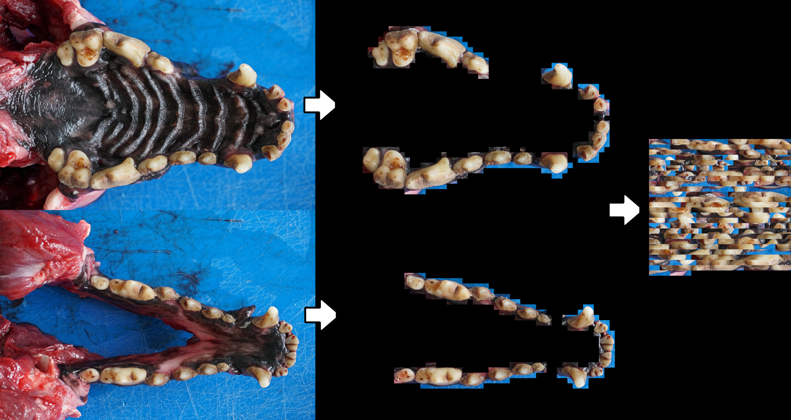

# DogTeethAge

The most practical method for estimating dog age is by the examination of his teeth. Unfortunately, human's accuracy of this method decreases sharply after a dog reaches its adulthood. This is because after the permanent (adult) teeth grow in and take the place of the primary teeth (usually by 6 months of age), the age assessment can depend only on the general state of the teeth and gingiva (on factors like tooth wear, cementum, and pulp cavity). Variations in diets, behavior, genetics, as well as diseases and trauma, can all influence those factors and introduce an "uncertainty" that is increasing with aging.

We hope that with the appropriate database, Deep Learning will be able to provide a more objective estimation of teeth age. 

This is **open research** which means that we are providing both the dataset and the code **before** publishing the paper. All contributions are welcome.

## The Data

In the [data directory](https://github.com/department-of-vet-pathology-unizg/dog_age/tree/master/data), we provided maxillas and mandibles images of 44 dogs together with their masks. The [data.csv](https://github.com/department-of-vet-pathology-unizg/dog_age/blob/master/data/Data.csv) file contains the age of every dog. All the data is, of course, anonymized.

The number of images in the database will increase over time

## Image Preprocessing

Our raw images are of a size 6000X4000px (24MP), which is too large for a neural network. One way to reduce the image size, while still keeping (most of) the data, is to extract only the teeth from every image. We decided to use masks to extract this data and create "mosaics" that contain both the maxilla's and mandible's extracted teeth.

You can use the [mozaic.py](https://github.com/department-of-vet-pathology-unizg/dog_age/blob/master/mosaic.py) file to parse the images into "mosaics".

